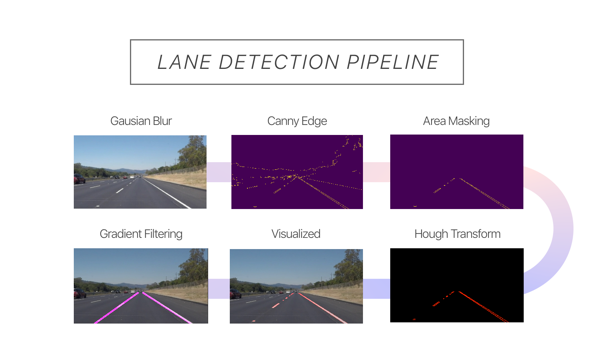

#**Finding Lane Lines on the Road** 

##Writeup 

---

**Finding Lane Lines on the Road**

The goals / steps of this project are the following:
* Make a pipeline that finds lane lines on the road
* Reflect on your work in a written report

---

### Reflection

###1. Describe your pipeline. As part of the description, explain how you modified the draw_lines() function.

### The pipeline 

1. Smoothing using gaussian blur 
2. Canny Edge detection 
3. Masking region of interest 
4. Hough Transform to identify lines
5. From Hough lines, calculate gradient of all lines 
6. Threshold lines to remove vertical lines 
7. Filter lines by positive and negative gradients to get left and right lines 
8. Calculate average gradient and b of longest n lines 
9. Get equation of line, find endpoints and plot on the image 
10. To increase stablitiy of lines under changing conditions, introduce smoothing , by averaging the last 10 frames

### Elaboration on how lane lines was calculated and drawn.
1. Calculate the gradients of all the lines returned from the hough transform
2. Threshold the gradients to remove horizontal lines, esp for the challenge video
3. Based on the computed gradients we can separate the left and right lane based on positive and negative gradients
4. Sort the gradients by length and choose the longest n gradients (just get the gradients of the longest lines)
5. Find the average of the gradient 
6. Get line equation
7. Plot points based on longest n lines

### White Lanes Video

### Yellow Lane Video

### Challenge Video (optional)

###2. Identify potential shortcomings with your current pipeline

* Pipeline will require finetuning for new driving scene
    * In reality the lighting conditions will vary greatly especially due to shadows from trees, other cars and changes in the road color. For each situation a different set of parameters would be required

* Responsiveness 
    * At the cost of stability comes responsivenes. The smoothing takes the average of the lines and delivers a smooth and stable lane detection and prevents sporadic behaviour. But it sacrifies on immediate responsiveness. But smoothing is required to remove events such as drastic changes in lighting, camera shakes and missing lane markings.

###3. Suggest possible improvements to your pipeline

* Can't map curved lines

    * Currently it can fit a line to a short section of the lane curve, but would like to develop a pipline that utilizes np.polyfit to fit the lane points to a second degree equation to get a more accurate mapping for curves. 

* Changes in Lighting Conditions and Lane-Marking Contrast

    * Utilizing Gamma correction we are able to normalize the image by a little and obtain more detail and hence more points to perform the hough detection on. **Update** I managed to implement the gamma correction followed by the reduction of the images brightness

* Color Stacking
    * Assuming you know the ranges of colors of the lane marking you could use color isolation to extract lane markings from the image and stack it against an the original darkned images to make the lanes even more pronounced.

* Parameter Finetuning 
    * Finetuning and finding the right parameters was thr most troublesome part as finding a set of parameters that would work well in many different test cases was a little troublesome. It would be good to setup a system where we could adjust the parameters live and get immediate feeback on the results. 

* Deep learning 
    * lol